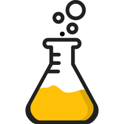

<h1 align="center">
  <picture>
    <source media="(prefers-color-scheme: dark)" srcset="ui/src/assets/flask_white.svg">
    
  </picture>
  Catalyst</h1>
<h3 align="center">Speed up your reactions</h3>
<h4 align="center">
<a href="https://catalyst.security-brewery.com/">Website</a>
- 
<a href="https://catalyst.security-brewery.com/docs/category/catalyst-handbook">The Catalyst Handbook (Documentation)</a>
-
<a href="https://try.catalyst.security-brewery.com/">Demo</a>
</h4>

Catalyst is an incident response platform.
It can help to automate your alert handling and incident response procedures.

## Features

### Ticket (Alert & Incident) Management

Tickets are the core of Catalyst.
They represent alerts, incidents, forensics investigations,
threat hunts or any other event you want to handle in your organisation.

    

### Tasks

Tasks are the smallest unit of work in Catalyst. They can be assigned to users and have a status.
Tasks can be used to document the progress of an investigation or to assign work to different users.

    

### Reactions

Reactions are a way to automate Catalyst.
Each reaction is composed of a trigger and an action.
The trigger listens for events and the action is executed when the trigger is activated.
There are triggers for HTTP/Webhooks and Collection Hooks and actions for Python and HTTP/Webhooks.

    

### Timelines

Timelines are used to document the progress of an investigation.
They can be used to document the steps taken during an investigation, the findings or the results of the investigation.

### Dashboards

Catalyst comes with a dashboard that presents the most important information at a glance.

    

### Ticket Types

Templates define the custom information for tickets.
The core information for tickets like title, creation date or closing status is kept quite minimal
and other information like criticality, description or MITRE ATT&CK information can be added individually.

### Custom Fields

Custom fields can be added to tickets to store additional information.
They can be used to store information like the affected system, the attacker's IP address or the type of malware.
Custom fields can be added to ticket types and are then available for all tickets of this type.

### More

Catalyst supports a lot more features like: Links, Files, or Comments on tickets.

## License
