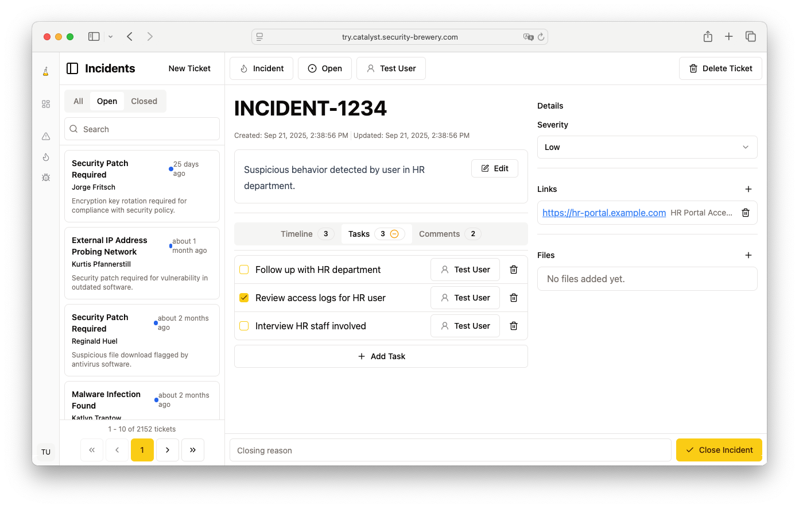
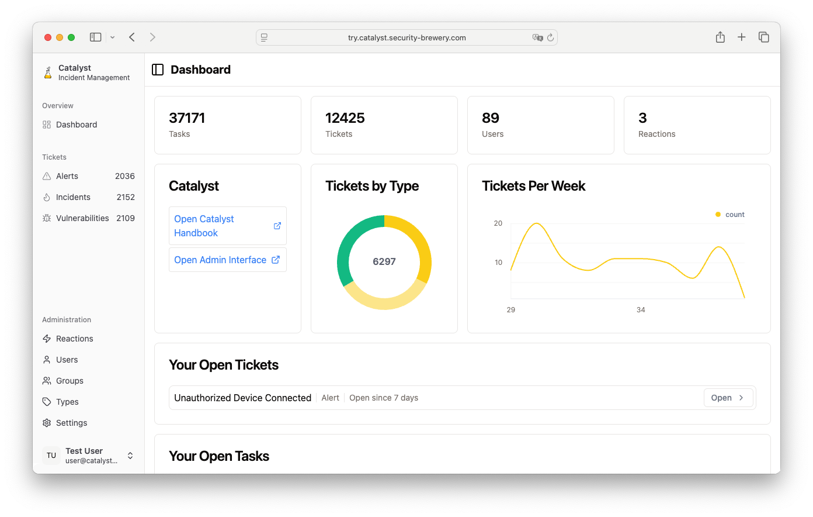

<h1 align="center">
  <picture>
    <source media="(prefers-color-scheme: dark)" srcset="ui/src/assets/flask_white.svg">
    
  </picture>
  Catalyst</h1>
<h3 align="center">Speed up your reactions</h3>
<h4 align="center">
<a href="https://catalyst.security-brewery.com/">Website</a>
- 
<a href="https://catalyst.security-brewery.com/docs/category/catalyst-handbook">The Catalyst Handbook (Documentation)</a>
-
<a href="https://try.catalyst.security-brewery.com/">Demo</a>
</h4>

Catalyst is an incident response platform.
It can help to automate your alert handling and incident response procedures.

## Features

### Ticket (Alert & Incident) Management

Tickets are the core of Catalyst.
They represent alerts, incidents, forensics investigations,
threat hunts or any other event you want to handle in your organisation.

    

### Ticket Types

Templates define the custom information for tickets. 
The core information for tickets like title, creation date or closing status is kept quite minimal 
and other information like criticality, description or MITRE ATT&CK information can be added individually.

### Timelines

Timelines are used to document the progress of an investigation.
They can be used to document the steps taken during an investigation, the findings or the results of the investigation.

### Tasks

Tasks are the smallest unit of work in Catalyst. They can be assigned to users and have a status.
Tasks can be used to document the progress of an investigation or to assign work to different users.

    

### Custom Fields

Custom fields can be added to tickets to store additional information.
They can be used to store information like the affected system, the attacker's IP address or the type of malware.
Custom fields can be added to ticket types and are then available for all tickets of this type.

### Playbooks

Playbooks represent processes that can be attached to tickets.
They are a collection of tasks that can be executed in a specific order.
Catalyst contains a playbook editor that allows you to create custom playbooks for your organisation.

### Dashboards

Catalyst comes with a dashboard that presents the most important information at a glance.

    

### Webhooks

Catalyst can send webhooks to other systems. 
This can be used to trigger actions in other systems and create automated workflows.

### Users

Catalyst supports authentication via username and password 
or via OAuth2 with an external identity provider like Google, GitHub or GitLab.

### More

Catalyst supports a lot more features like: Links, Files, or Comments on tickets.