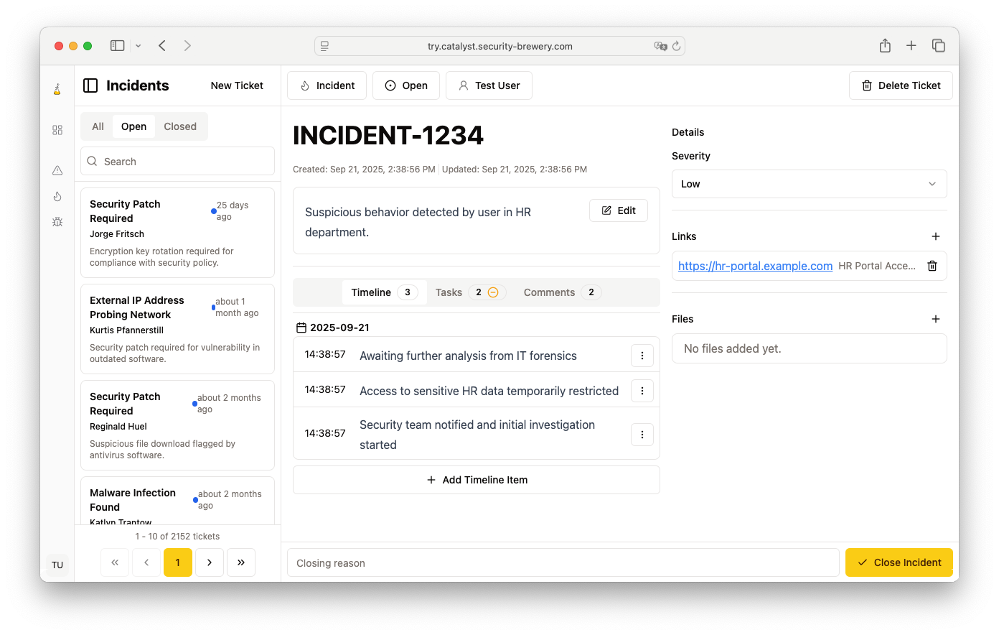

<h1 align="center">
  
  Catalyst</h1>
<h3 align="center">Speed up your reactions</h3>
<h4 align="center">
<a href="https://catalyst-soar.com">Website</a>
- 
<a href="https://catalyst-soar.com/docs/category/catalyst-handbook">The Catalyst Handbook (Documentation)</a>
-
<a href="https://try.catalyst-soar.com">Try online</a>
</h4>
<h4 align="center">
<a href="https://twitter.com/securitybrewery">Twitter</a>
- 
<a href="https://discord.gg/nrmpveWvZX">Discord</a>
</h4>

Catalyst is an incident response platform or SOAR (Security Orchestration, Automation and Response) system. It can help
you to automate your alert handling and incident response procedures.

## Features

### Ticket (Alert & Incident) Management

Tickets are the core of Catalyst. They represent alerts, incidents, forensics
investigations, threat hunts or any other event you want to handle in your
organisation.

### Ticket Templates

  

Templates define the custom information for tickets. The core information for
tickets like title, creation date or closing status is kept quite minimal and other
information like criticality, description or MITRE ATT&CK information can be
added individually.

### Conditional Custom Fields

  
  

Custom Fields can be dependent on each other. So if you, for example choose
"malware" as an incident type a custom field ask you to define it further as
ransomware, worm, etc. which a "phishing" incident would ask for the number
of received mails in that campaign.

### Playbooks

  

Playbooks represent processes that can be attached to tickets. Playbooks can
contain manual and automated tasks. Complex workflows with different workflow
branches, parallel tasks and task dependencies can be modeled.

### Automations

  

Automations are scripts that automate tasks or enrich artifacts. Automations are
run in their own Docker containers. This enables them to be created in different
scripting languages and run securely in their own environment.

### Dashboards

  

Catalyst comes with a dashboard editor that allows you to create custom dashboards
for your organisation. Dashboards can be created with line, bar, and pie charts.

### Users

Catalyst has two different types of users, normal users accessing the platform
via OIDC authentication and API keys for external script. A
fine-grained access model is available for both types and allows to define
possible actions for each user.

## License

Copyright (c) 2021-present Jonas Plum

Portions of this software are licensed as follows:

* All third party components incorporated into Catalyst are licensed under the
  original license provided by the owner of the applicable component. Those
  files contain a license notice on top of the file and are listed in the
  [NOTICE](NOTICE) file.
* Content outside the above-mentioned files above is
  available under the [GNU Affero General Public License v3.0](LICENSE).
